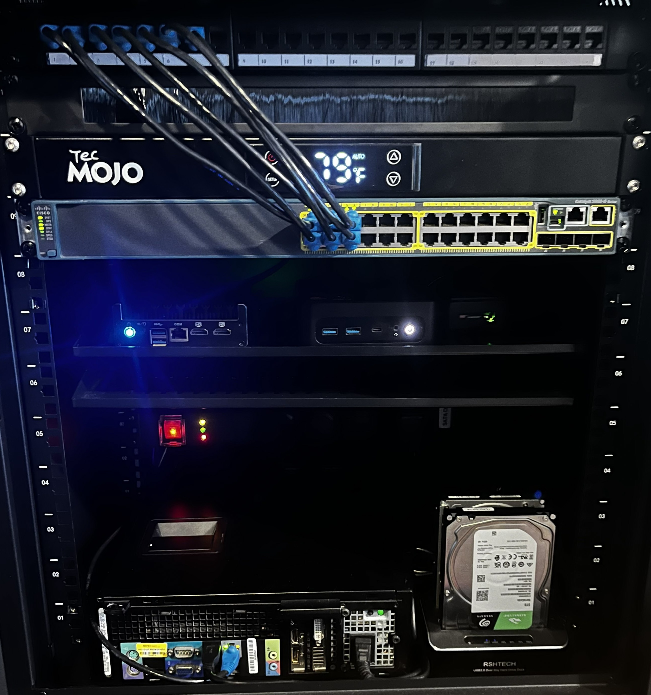

# Homelab Firewall & Switch Network

This repository documents the configuration and topology of a self-contained lab network built around a **Protectli FW4C** running **pfSense CE** and a **Cisco WS-C2960S-24TS-L** managed switch.  
The lab network is fully segmented from the home Wi-Fi network and used for firewall testing, VLAN design, and cybersecurity practice.

---

## Lab Photo



---

## Hardware Overview

| Device | Role | Notes |
|---------|------|-------|
| Protectli FW4C | pfSense firewall & router | WAN from home router, LAN trunk to switch |
| Cisco WS-C2960S-24TS-L | Managed Layer 2 switch | VLAN trunk & segmentation |
| TP-Link EAP653 | Wi-Fi 6 Access Point | VLAN20 (IoT), powered by 12V DC adapter |
| Bosgame Mini PC | Lab server | VLAN40 (Lab) |
| Raspberry Pi 5 | Sandbox node / controllers | VLAN40 (Lab) |
| Dell OptiPlex | Test workstation / SIEM node | VLAN10 (Trusted) |
| Desktop PC | Admin desktop | VLAN10 (Trusted) |
| ThinkPad (Kali) | Pentesting laptop | VLAN40 (Lab) |
| Patch Panel (24-Port) | Physical cable management | WAN + LAN organized by port |

---

## High-Level Topology

```
[Home Router/Wi-Fi]
       │
   (Patch Port 1)
       │
[Protectli FW4C - WAN]
[Protectli FW4C - LAN]
       │
   (Patch Port 2)
       │
[Cisco Switch Gi1/0/1 - Trunk]
       │
 ┌───────────────┬──────────────┬───────────────┬───────────────┐
 │ VLAN10        │ VLAN20       │ VLAN40        │ VLAN99        │
 │ Trusted PCs   │ IoT / EAP653 │ Lab Devices   │ Switch Mgmt   │
 └───────────────┴──────────────┴───────────────┴───────────────┘
```

---

## VLAN Summary

| VLAN | Name | Purpose | Subnet | DHCP Range | Notes |
|------|------|----------|---------|-------------|-------|
| 10 | Trusted | Admin + Workstations | 192.168.10.0/24 | .50–.199 | Native VLAN |
| 20 | IoT | Smart/isolated + Wi-Fi | 192.168.20.0/24 | .50–.199 | EAP653 Access Point |
| 30 | Guest | Temporary external | 192.168.30.0/24 | .50–.199 | Internet-only |
| 40 | Lab | Servers + testing | 192.168.40.0/24 | .50–.199 | For VMs, Pis, etc. |
| 99 | Mgmt | Infrastructure management | 192.168.99.0/24 | Static only | Switch mgmt |

---

## Documentation

| File | Description |
|------|--------------|
| `01_rack_plan_and_inventory.md` | Rack elevation and full inventory |
| `02_physical_topology.md` | Rack wiring, patch panel, and switch mapping |
| `03_network_design.md` | VLAN plan, subnets, and IP addressing |
| `04_switch_configuration.md` | Cisco WS-C2960S trunk + access port config |
| `05_pfsense_configuration.md` | pfSense VLANs, DHCP, and firewall setup |
| `06_testing_and_verification.md` | Connectivity and isolation tests |

---

## Network Isolation Summary

- VLAN20 (IoT + TP-Link EAP653 Wi-Fi) is **isolated** from VLAN10 and VLAN40.
- VLAN10 (Trusted) can manage pfSense and the switch (VLAN99).
- VLAN30 (Guest) has Internet-only access.
- VLAN40 (Lab) isolated for SIEM and Proxmox workloads.

---

## Future Plans

- Automate VLAN + firewall provisioning using **Ansible**
- Deploy internal DNS and Pi-hole container on Bosgame mini PC
- Add OpenVPN or WireGuard remote access for lab testing
- Document configuration backups and syslog setup
